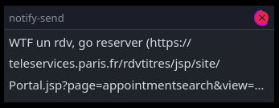

# CNI-sniper

!!! ONLY PARIS !!!

Pas de rdv et flemme de refresh ?

A Paris ya jamais de rdv et yen a marre, ce script enverra une notification sur votre bureau si il y a des dispos (je sais pas sil marche vu que ya jamais de rdv mdr)

# Install

Need `wget`, `notify-send` and `grep`

In case `chmod +x script.sh` in the cloned repository

`crontab -e` (install package `cron` if needed) and append using your favorite editor the following line:  
```
* * * * * <path_to_cloned_repository>/script.sh
```
example:
```
* * * * * /home/arthur/Desktop/CNI-sniper/script.sh
```

# Uninstall

Remove the line you appened to the crontab (`crontab -e` to edit)

# How it should look


